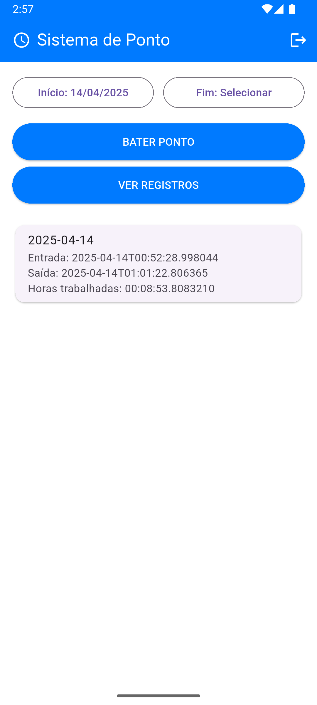

# SistemaDePonto

Sistema de ponto digital desenvolvido com Flutter (mobile) e ASP.NET Core (.NET 8) para controle de jornada de trabalho, com autenticação via Firebase e registro de marcações de entrada/saída em uma API RESTful.

---

## Tecnologias Utilizadas

### Backend (.NET 8)
- ASP.NET Core Web API
- Entity Framework Core
- MySQL
- Autenticação via JWT
- Swagger

### Mobile (Flutter)
- Flutter SDK
- Firebase Authentication
- Integração REST com a API
- Material Design

---

## Funcionalidades

- Autenticação de usuários com e-mail/senha (via Firebase)
- Registro de ponto com horário de entrada/saída
- Filtro por intervalo de datas
- Persistência das marcações no banco de dados
- Interface responsiva e moderna

---

## Estrutura do Projeto

```
SistemaDePonto/
├── backend/        # API .NET 8.0
├── mobile/         # App Flutter
├── assets/         # Imagens para o README
└── README.md
```

---

## Screenshots

<div style="display: flex; gap: 10px;">
  
  
</div>

---

## Pré-requisitos

### Geral
- Git instalado
- Acesso à internet

### Backend (API .NET 8)
- [.NET 8 SDK](https://dotnet.microsoft.com/en-us/download/dotnet/8.0)
- MySQL Server (local ou Docker)
- Visual Studio 2022 ou VS Code com extensão C#
- EF Core CLI instalada

### Mobile (Flutter)
- [Flutter SDK](https://flutter.dev/docs/get-started/install)
- Android Studio ou VS Code com plugin Flutter
- Emulador Android ou dispositivo físico
- Conta no Firebase com projeto criado
- Firebase Authentication (habilitado com e-mail/senha)
- Arquivo `google-services.json` (em `mobile/android/app/`)

---

## Como Rodar o Projeto

### 1. Clonar o repositório

```bash
git clone https://github.com/mrffilipe/SistemaDePonto.git
cd SistemaDePonto
```

---

### 2. Rodar o Backend

```bash
cd backend
dotnet restore
dotnet ef database update
dotnet run
```

> Certifique-se de configurar o `appsettings.Development.json` com:
> - A string de conexão do MySQL
> - A variável de ambiente com o ProjectID do projeto Firebase

---

### 3. Rodar o App Flutter

```bash
cd ../mobile
flutter pub get
flutter run
```

> Certifique-se de que:
> - O dispositivo/emulador está ativo
> - O arquivo `google-services.json` está correto e no local certo
> - O app está apontando para o IP da API corretamente (substituir `localhost` por IP da máquina local)

---

## Contato

Desenvolvido por **Filipe Ferraciolli**  
[LinkedIn](https://linkedin.com/in/mrffilipe) | [GitHub](https://github.com/mrffilipe)
